# Sales ERP 技术架构与设计文档

> 文档版本：v1.0
> 更新日期：2026/04/23
> 适用对象：后端/前端开发、架构师、DevOps

---

## 一、技术架构总览

### 1.1 分层架构

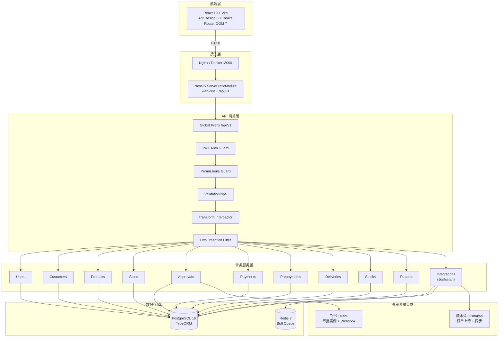

### 1.2 技术选型与版本

| 层级 | 技术 | 版本 | 选型理由 |
|------|------|------|---------|
| 前端框架 | React | 19.2.4 | 最新版本，并发特性，性能优化 |
| 前端构建 | Vite | 8.0.4 | 极速 HMR，现代化构建工具 |
| UI 组件库 | Ant Design | 6.3.5 | 企业级组件，中后台首选 |
| 路由 | React Router DOM | 7.14.1 | 声明式路由，支持嵌套路由 |
| 状态管理 | localStorage + Context | - | 轻量级，无需引入 Redux |
| 后端框架 | NestJS | 11.0.1 | 模块化、IoC、企业级 Node.js 框架 |
| ORM | TypeORM | 0.3.28 | 装饰器驱动，支持 ActiveRecord/DataMapper |
| 数据库 | PostgreSQL | 16 | JSONB 支持，复杂查询性能优秀 |
| 缓存/队列 | Redis + Bull | 7 / 4.16.5 | 可靠的消息队列，支持延迟/重试 |
| 认证 | Passport + JWT | - | 标准化认证中间件 |
| 定时任务 | @nestjs/schedule | 6.1.2 | 基于 node-cron，集成度高 |
| 容器化 | Docker Compose | - | 一键部署，环境一致性 |

---

## 二、后端架构设计

### 2.1 NestJS 模块设计

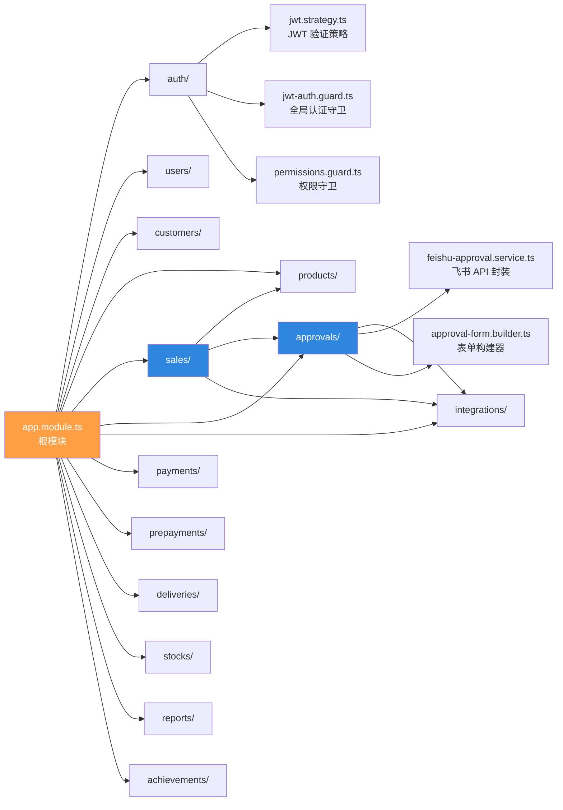

### 2.2 全局中间件与守卫执行顺序

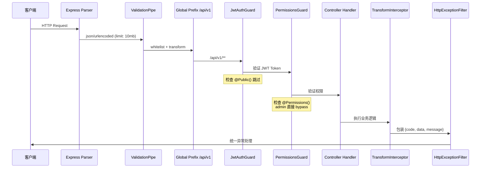

### 2.3 认证与授权设计

#### JWT 认证流程

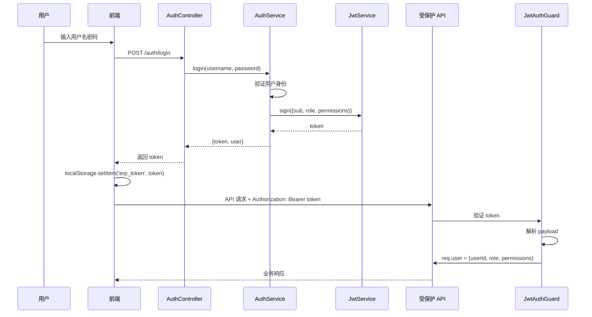

#### 权限模型（RBAC）

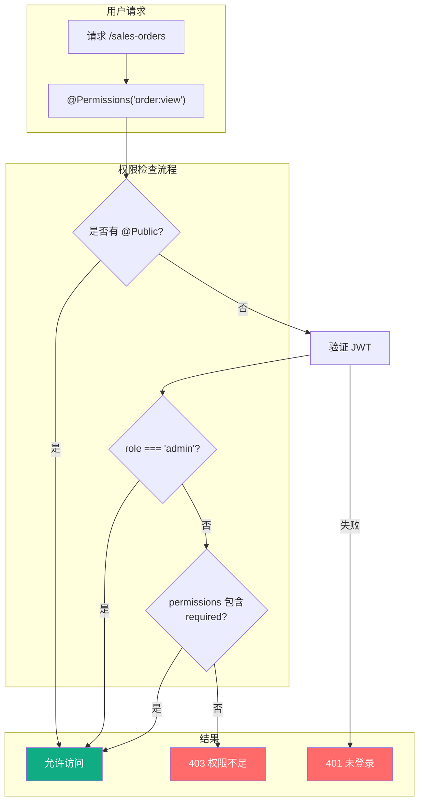

**权限存储：**
- 后端：User 实体 `permissions` 字段（jsonb 数组）
- 前端：`localStorage.getItem('erp_permissions')`
- JWT payload：`{ sub, username, role, permissions }`

### 2.4 核心业务模块设计

#### SalesModule 依赖关系

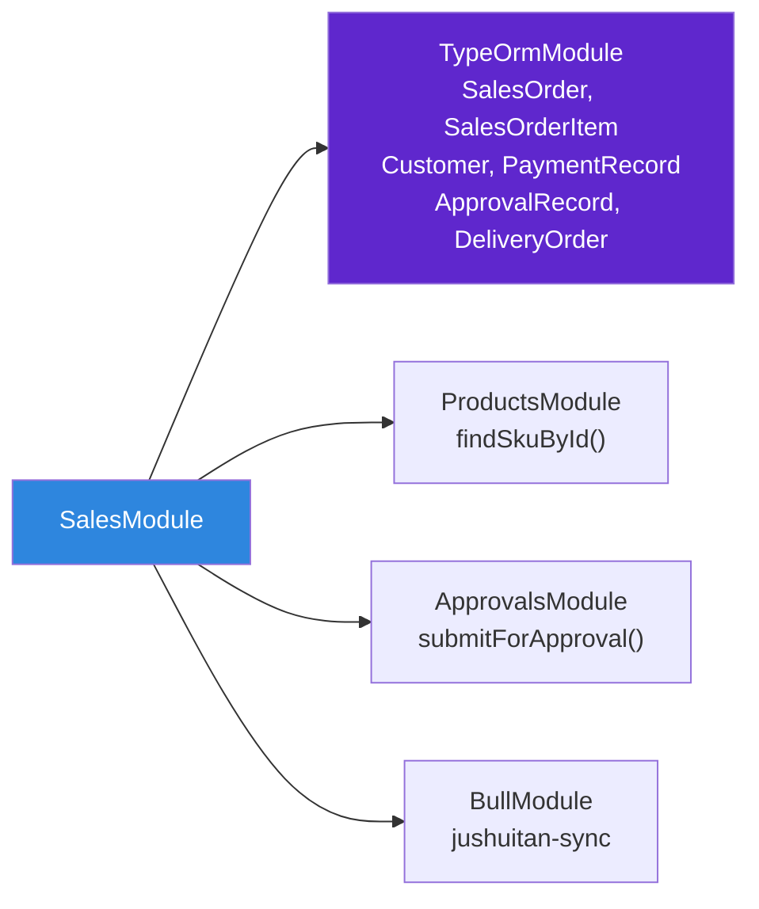

**关键设计决策：**
- `create()` 使用 `DataSource.transaction()` 保证订单和明细的原子性
- `findOne()` 手动查询 approvalRecords 和 deliveryOrders（非 TypeORM relations），避免 N+1
- `submit()` 仅允许 draft 状态提交，状态校验前置

#### ApprovalsModule 回调处理流程

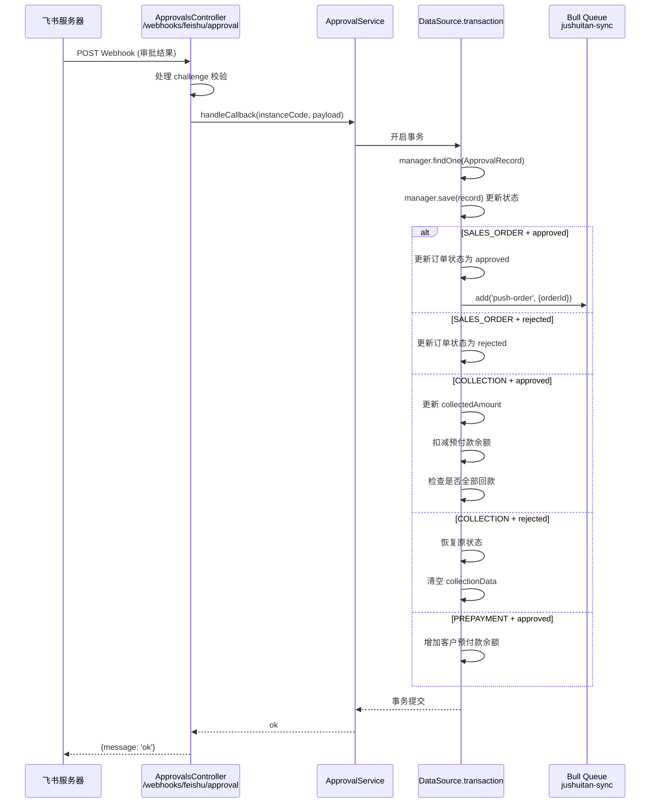

### 2.5 外部集成设计

#### 飞书集成（FeishuApprovalService）

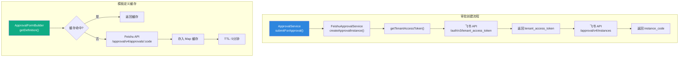

**设计特点：**
- 无状态服务，不缓存 tenant_access_token（简化实现，每次请求重新获取）
- ApprovalFormBuilder 缓存模板定义 5 分钟，减少 API 调用
- 严格校验 `user_id_type === 'user_id'`，提前失败给出明确错误

#### 聚水潭集成（JushuitanService）

```mermaid
graph TD
    subgraph 签名算法["签名算法"]
        S1["参数对象"] --> S2["过滤 sign, null, ''"]
        S2 --> S3["按 key 排序"]
        S3 --> S4["拼接 key1value1key2value2..."]
        S4 --> S5["raw = appSecret + sortedString"]
        S5 --> S6["sign = MD5(raw)"]
    end

    subgraph 请求封装["请求封装"]
        R1["request(endpoint, bizParams)"] --> R2["构建参数"]
        R2 --> R3["app_key, access_token, timestamp<br/>charset, version, biz(JSON)"]
        R3 --> R4["计算 sign"]
        R4 --> R5["form-urlencoded POST"]
        R5 --> R6["openapi.jushuitan.com"]
    end

    style S6 fill:#ff9f43,color:#fff
    style R5 fill:#2e86de,color:#fff
```

#### 异步任务队列（Bull）

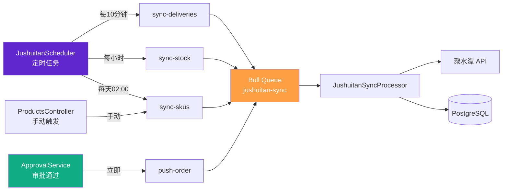

| Queue Name | Job Type | Processor | 触发方式 |
|-----------|----------|-----------|---------|
| `jushuitan-sync` | `push-order` | JushuitanSyncProcessor | 审批通过后自动 |
| `jushuitan-sync` | `sync-stock` | JushuitanSyncProcessor | 每小时定时 |
| `jushuitan-sync` | `sync-deliveries` | JushuitanSyncProcessor | 每10分钟定时 |
| `jushuitan-sync` | `sync-skus` | JushuitanSyncProcessor | 每天02:00 + 手动 |

### 2.6 数据库设计

#### 实体继承关系

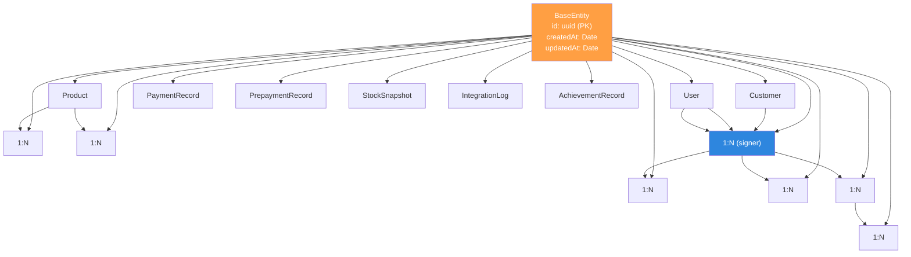

#### 关键索引建议

```sql
-- 订单查询（按客户、状态、创建时间）
CREATE INDEX idx_sales_orders_customer_id ON sales_orders(customer_id);
CREATE INDEX idx_sales_orders_status ON sales_orders(status);
CREATE INDEX idx_sales_orders_created_at ON sales_orders(created_at DESC);

-- 审批记录查询（按实例码）
CREATE INDEX idx_approval_records_instance_code ON approval_records(feishu_instance_code);
CREATE INDEX idx_approval_records_order_id ON approval_records(sales_order_id);

-- SKU 查询（按聚水潭 ID）
CREATE INDEX idx_product_skus_jst_id ON product_skus(jst_sku_id);
CREATE INDEX idx_products_jst_id ON products(jst_goods_id);

-- 发货单查询（按订单 ID）
CREATE INDEX idx_delivery_orders_sales_order_id ON delivery_orders(sales_order_id);
```

---

## 三、前端架构设计

### 3.1 目录结构

```mermaid
graph TD
    src["web/src/"] --> main["main.tsx<br/>应用入口"]
    src --> App["App.tsx<br/>路由定义 + 权限路由"]
    src --> api["api/"]
    src --> components["components/"]
    src --> pages["pages/"]
    src --> types["types/"]
    src --> utils["utils/"]
    src --> config["config.ts"]

    api --> axios["axios.ts<br/>拦截器 + 401处理"]
    api --> authApi["auth.ts"]
    api --> usersApi["users.ts"]
    api --> customersApi["customers.ts"]
    api --> productsApi["products.ts"]
    api --> salesApi["sales.ts"]
    api --> prepaymentsApi["prepayments.ts"]
    api --> approvalsApi["approvals.ts"]
    api --> reportsApi["reports.ts"]

    components --> AppLayout["AppLayout.tsx<br/>侧边栏 + Header"]
    components --> StatusTag["StatusTag.tsx"]
    components --> FormDrawer["SalesOrderFormDrawer.tsx"]
    components --> DetailModal["SalesOrderDetailModal.tsx"]
    components --> RegionCascader["RegionCascader.tsx"]

    pages --> Login["LoginPage.tsx"]
    pages --> Dashboard["DashboardPage.tsx"]
    pages --> Customer["CustomerPage.tsx"]
    pages --> Product["ProductPage.tsx"]
    pages --> SalesOrder["SalesOrderPage.tsx"]
    pages --> Prepayment["PrepaymentPage.tsx"]
    pages --> Approval["ApprovalPage.tsx"]
    pages --> Report["ReportPage.tsx"]
    pages --> Admin["AdminPage.tsx"]

    utils --> permissions["permissions.ts<br/>权限检查工具"]
    utils --> address["addressParser.ts<br/>地址解析工具"]

    style axios fill:#2e86de,color:#fff
    style AppLayout fill:#10ac84,color:#fff
```

### 3.2 Axios 拦截器设计

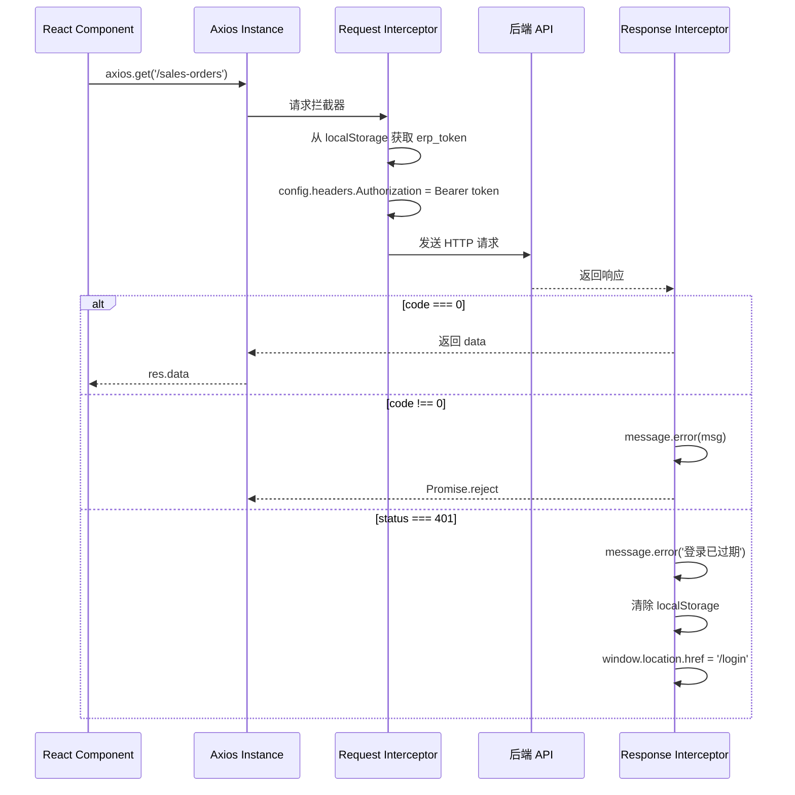

### 3.3 路由与权限

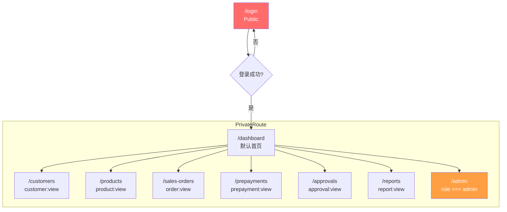

**菜单过滤逻辑：**
```typescript
const items = allItems.filter(i => !i.permission || hasPermission(i.permission));
```

---

## 四、安全设计

### 4.1 认证安全

| 措施 | 实现 |
|------|------|
| Token 存储 | localStorage（前端）+ JWT（后端） |
| Token 过期 | 7 天（JWT signOptions.expiresIn） |
| 密码传输 | 明文传输（**待改进**：应使用 HTTPS + 前端加密） |
| 密码存储 | **当前明文**（**必须修复**：应使用 bcrypt 哈希） |
| 飞书 OAuth | 授权码模式，后端换取 token |

### 4.2 接口安全

| 措施 | 实现 |
|------|------|
| 全局认证 | JwtAuthGuard（除 @Public 标记的接口） |
| 权限控制 | PermissionsGuard + @Permissions 装饰器 |
| 输入校验 | ValidationPipe（whitelist: true, transform: true） |
| 参数化查询 | TypeORM Repository API（天然防 SQL 注入） |
| CORS | 未显式配置（内网部署，依赖 Nginx） |

### 4.3 外部系统安全

| 系统 | 安全措施 |
|------|---------|
| 飞书 API | tenant_access_token 不缓存，每次请求重新获取 |
| 聚水潭 API | MD5 签名 + appSecret，form-urlencoded 传输 |
| Webhook | 仅处理 challenge 校验（**待改进**：应增加签名验证） |

---

## 五、部署架构

### 5.1 Docker Compose 配置

```yaml
services:
  app:
    build: .
    ports: ['3000:3000']
    volumes: ['./uploads:/app/uploads']
    depends_on: [db, redis]

  db:
    image: postgres:16-alpine
    volumes: ['./data/postgres:/var/lib/postgresql/data']
    ports: ['5432:5432']

  redis:
    image: redis:7-alpine
    volumes: ['./data/redis:/data']
    ports: ['6379:6379']
```

### 5.2 Dockerfile 构建流程

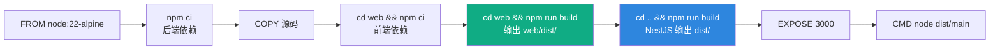

### 5.3 数据持久化

| 数据类型 | 挂载路径 | 说明 |
|---------|---------|------|
| 数据库 | `./data/postgres` | PostgreSQL 数据文件 |
| 缓存 | `./data/redis` | Redis 持久化文件 |
| 上传文件 | `./uploads` | 用户上传的附件 |

---

## 六、性能设计

### 6.1 数据库性能

| 策略 | 实现 |
|------|------|
| 分页查询 | findAndCount + skip/take（所有列表接口） |
| 关联查询 | TypeORM relations（控制关联深度，避免过度 fetch） |
| 事务隔离 | 订单创建/编辑/回调均使用显式事务 |
| 索引 | 关键外键和查询字段已建索引 |

### 6.2 缓存策略

| 缓存对象 | 方式 | TTL |
|---------|------|-----|
| 飞书审批模板 | 内存 Map | 5 分钟 |
| 用户权限 | localStorage | 会话级 |
| 飞书 User ID | localStorage | 会话级 |

### 6.3 异步处理

| 场景 | 处理方式 |
|------|---------|
| 订单推送聚水潭 | Bull 队列（审批通过后异步处理） |
| SKU 同步 | Bull 队列 + 定时任务（大分页 + 窗口查询） |
| 发货单同步 | Bull 队列 + 定时任务 |
| 库存同步 | Bull 队列 + 定时任务 |

---

## 七、扩展性设计

### 7.1 多租户预留

当前系统为单租户设计，多租户扩展方向：
- 所有实体增加 `tenant_id` 字段
- JWT payload 增加 `tenant_id`
- 查询时自动附加 `tenant_id` 过滤（TypeORM Scope 或 Interceptor）

### 7.2 微服务拆分预留

当前模块间耦合度较低，未来可按业务域拆分：
- `sales-service`：订单、审批、回款
- `masterdata-service`：客户、产品、用户
- `integration-service`：聚水潭同步
- `report-service`：报表、业绩

### 7.3 消息队列扩展

当前仅使用一个队列 `jushuitan-sync`，未来可按业务拆分：
- `notification-queue`：消息通知（飞书消息推送）
- `export-queue`：数据导出任务
- `audit-queue`：操作日志异步写入

---

## 八、开发规范

### 8.1 API 设计规范

```typescript
// 统一响应格式
interface ApiResponse<T> {
  code: number;      // 0 = 成功，非0 = 错误码
  data: T;           // 业务数据
  message: string;   // 提示信息
}

// 列表响应
interface ListResponse<T> {
  data: T[];
  total: number;
  page: number;
  pageSize: number;
}

// 错误响应（HttpExceptionFilter）
{
  code: 400,
  data: null,
  message: '错误描述',
  path: '/api/v1/sales-orders/xxx'
}
```

### 8.2 代码组织规范

- **Controller**：只负责 HTTP 层（路由、参数解析、调用 Service）
- **Service**：核心业务逻辑（事务、数据校验、外部调用）
- **Repository**：TypeORM Repository，不直接写 SQL
- **DTO**：class-validator 校验 + class-transformer 转换
- **Entity**：数据库映射，含关系定义

### 8.3 日志规范

```typescript
// 使用 NestJS Logger
private readonly logger = new Logger(XxxService.name);

// 正确
this.logger.log(`Order ${id} created`);
this.logger.error(`Push failed: ${err.message}`, err.stack);

// 禁止
console.log('debug');
console.error('error');
```

---

## 九、附录

### 9.1 环境变量清单

```bash
# 数据库
DB_HOST=db
DB_PORT=5432
DB_USERNAME=postgres
DB_PASSWORD=postgres
DB_NAME=sales_erp

# Redis
REDIS_HOST=redis
REDIS_PORT=6379

# 飞书
FEISHU_APP_ID=cli_xxx
FEISHU_APP_SECRET=xxx

# 聚水潭
JUSHUITAN_APP_KEY=xxx
JUSHUITAN_APP_SECRET=xxx
JUSHUITAN_ACCESS_TOKEN=xxx
JUSHUITAN_SHOP_ID=xxx

# JWT
JWT_SECRET=xxx

# 其他
NGROK_URL=https://xxx.ngrok-free.app
NODE_ENV=production
PORT=3000
DB_SYNC=false
```

### 9.2 相关技术文档

- [NestJS 官方文档](https://docs.nestjs.com/)
- [TypeORM 文档](https://typeorm.io/)
- [飞书开放平台](https://open.feishu.cn/)
- [聚水潭开放平台](https://open.jushuitan.com/)
- [Ant Design](https://ant.design/)
- [React Router](https://reactrouter.com/)
