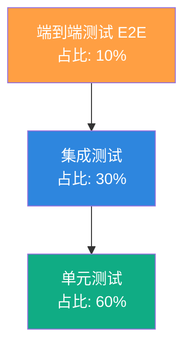

# Sales ERP 测试与质量保证文档

> 文档版本：v1.0
> 更新日期：2026/04/23
> 适用对象：QA、开发、DevOps

---

## 一、测试策略总览

### 1.1 测试金字塔



### 1.2 测试分层策略

| 测试层级 | 工具 | 范围 | 目标 | 执行时机 |
|---------|------|------|------|---------|
| **单元测试** | Jest + ts-jest | Service、Util、DTO | 单函数/方法正确性 | 每次 commit 前 |
| **集成测试** | Jest + @nestjs/testing + supertest | Controller + Service + DB | 模块间协作正确性 | CI Pipeline |
| **E2E 测试** | Playwright | 前端页面 + 后端 API | 完整用户流程 | 每日/发布前 |
| **API 测试** | supertest | HTTP 接口 | 接口契约符合性 | CI Pipeline |

### 1.3 测试覆盖目标

| 模块 | 单元测试目标 | 集成测试目标 | 优先级 |
|------|------------|------------|--------|
| auth | 80% | 100% | P0 |
| users | 80% | 100% | P0 |
| sales | 80% | 100% | P0 |
| approvals | 80% | 100% | P0 |
| integrations (Jushuitan) | 60% | 80% | P1 |
| customers | 70% | 80% | P1 |
| products | 70% | 80% | P1 |
| reports | 50% | 60% | P2 |
| frontend components | 50% | - | P1 |
| frontend pages | - | 80% (E2E) | P1 |

---

## 二、单元测试规范

### 2.1 后端单元测试

#### 测试框架配置

```typescript
// jest.config.ts (package.json 中配置)
{
  "jest": {
    "moduleFileExtensions": ["js", "json", "ts"],
    "rootDir": "src",
    "testRegex": ".*\\.spec\\.ts$",
    "transform": {
      "^.+\\.(t|j)s$": "ts-jest"
    },
    "collectCoverageFrom": ["**/*.(t|j)s"],
    "coverageDirectory": "../coverage",
    "testEnvironment": "node"
  }
}
```

#### Service 测试模板

```typescript
import { Test, TestingModule } from '@nestjs/testing';
import { getRepositoryToken } from '@nestjs/typeorm';
import { Repository } from 'typeorm';
import { SalesService } from './sales.service';
import { SalesOrder, SalesOrderStatus } from './entities/sales-order.entity';

// Mock Repository
const mockRepository = () => ({
  findOne: jest.fn(),
  findAndCount: jest.fn(),
  save: jest.fn(),
  create: jest.fn(),
});

describe('SalesService', () => {
  let service: SalesService;
  let orderRepo: MockType<Repository<SalesOrder>>;

  beforeEach(async () => {
    const module: TestingModule = await Test.createTestingModule({
      providers: [
        SalesService,
        {
          provide: getRepositoryToken(SalesOrder),
          useFactory: mockRepository,
        },
        // ... 其他依赖
      ],
    }).compile();

    service = module.get<SalesService>(SalesService);
    orderRepo = module.get(getRepositoryToken(SalesOrder));
  });

  describe('create', () => {
    it('should create a draft order with correct total amount', async () => {
      // Arrange
      const dto = {
        customerId: 'cust-1',
        type: SalesOrderType.SALES,
        items: [
          { productId: 'p1', skuId: 'sku1', qty: 2, unitPrice: 100 },
        ],
      };

      // Act
      const result = await service.create(dto, 'user-1');

      // Assert
      expect(result.status).toBe(SalesOrderStatus.DRAFT);
      expect(result.totalAmount).toBe(200);
    });

    it('should throw NotFoundException when SKU not found', async () => {
      // Arrange
      jest.spyOn(productsService, 'findSkuById').mockResolvedValue(null);

      // Act & Assert
      await expect(service.create(dto, 'user-1')).rejects.toThrow(
        NotFoundException,
      );
    });
  });
});
```

#### 关键测试场景（SalesService）

```typescript
describe('SalesService', () => {
  describe('create', () => {
    it('应创建草稿状态的订单');
    it('应正确计算订单总金额和应付金额');
    it('SKU 不存在时应抛出 NotFoundException');
    it('缺少 product 关联时应抛出 NotFoundException');
    it('应在事务中创建订单和明细');
    it('应正确填充 productName 和 skuName');
  });

  describe('findAll', () => {
    it('应返回分页格式的订单列表');
    it('应按 createdAt 降序排列');
    it('应关联 customer、items、signer');
  });

  describe('findOne', () => {
    it('应返回订单及关联的审批记录和发货单');
    it('订单不存在时应抛出 NotFoundException');
  });

  describe('submit', () => {
    it('草稿订单应成功提交审批');
    it('非草稿状态应抛出 BadRequestException');
    it('应调用 approvalService.submitForApproval');
    it('提交后状态应变为 PENDING_APPROVAL');
  });

  describe('submitCollectionForApproval', () => {
    it('approved 状态订单应允许回款');
    it('draft 状态订单应不允许回款');
    it('超额回款应抛出 BadRequestException');
    it('预付款超额抵扣应抛出 BadRequestException');
    it('回款后状态应变为 PENDING_APPROVAL');
  });

  describe('updateOrder', () => {
    it('草稿订单应允许编辑');
    it('驳回订单应允许编辑并重置为草稿');
    it('approved 订单应不允许编辑');
    it('编辑后应重新计算总金额');
    it('应在事务中更新');
  });
});
```

#### 关键测试场景（ApprovalService）

```typescript
describe('ApprovalService', () => {
  describe('handleCallback', () => {
    it('应在事务中处理回调');
    it('sales_order 审批通过应更新订单为 approved');
    it('sales_order 审批通过应加入推送队列');
    it('sales_order 审批驳回应更新订单为 rejected');
    it('collection 审批通过应更新 collectedAmount');
    it('collection 审批通过应扣减预付款余额');
    it('collection 审批通过全部回款应更新为 completed');
    it('collection 审批驳回应恢复原状态');
    it('prepayment 审批通过应增加客户预付款余额');
    it('找不到审批记录时应记录警告并返回');
  });
});
```

#### 关键测试场景（AuthService）

```typescript
describe('AuthService', () => {
  describe('login', () => {
    it('正确用户名密码应返回 token 和用户信息');
    it('用户不存在应抛出 UnauthorizedException');
    it('密码错误应抛出 UnauthorizedException');
    it('返回的用户信息应包含 role 和 permissions');
    it('JWT payload 应包含 role 和 permissions');
  });

  describe('feishuCallback', () => {
    it('新用户应自动创建并返回 token');
    it('已存在用户应更新 feishuUserId 和 feishuUnionId');
    it('无法获取 open_id 应抛出 UnauthorizedException');
    it('应尝试通过 contact API 补全 user_id');
  });
});
```

### 2.2 前端单元测试

#### 测试框架配置

```typescript
// vitest.config.ts
import { defineConfig } from 'vitest/config';

export default defineConfig({
  test: {
    environment: 'jsdom',
    globals: true,
    setupFiles: ['./src/test/setup.ts'],
  },
});
```

#### 组件测试模板

```typescript
import { describe, it, expect, vi } from 'vitest';
import { render, screen, fireEvent } from '@testing-library/react';
import StatusTag from '@/components/StatusTag';

describe('StatusTag', () => {
  it('draft 状态应显示"草稿"', () => {
    render(<StatusTag status="draft" />);
    expect(screen.getByText('草稿')).toBeInTheDocument();
  });

  it('approved 状态未回款应显示"待回款"', () => {
    render(
      <StatusTag
        status="approved"
        collectedAmount={0}
        payAmount={1000}
        prepaymentDeducted={0}
      />,
    );
    expect(screen.getByText('待回款')).toBeInTheDocument();
  });

  it('approved 状态全部回款应显示"已回款"', () => {
    render(
      <StatusTag
        status="approved"
        collectedAmount={1000}
        payAmount={1000}
        prepaymentDeducted={0}
      />,
    );
    expect(screen.getByText('已回款')).toBeInTheDocument();
  });
});
```

#### 权限工具测试

```typescript
describe('permissions', () => {
  beforeEach(() => {
    localStorage.clear();
  });

  it('admin 角色应拥有所有权限', () => {
    localStorage.setItem('erp_role', 'admin');
    expect(hasPermission('order:create')).toBe(true);
    expect(hasPermission('admin:users')).toBe(true);
  });

  it('普通用户应只能访问已分配的权限', () => {
    localStorage.setItem('erp_permissions', JSON.stringify(['order:view']));
    expect(hasPermission('order:view')).toBe(true);
    expect(hasPermission('order:create')).toBe(false);
  });

  it('无权限时应返回 false', () => {
    expect(hasPermission('order:view')).toBe(false);
  });
});
```

---

## 三、集成测试规范

### 3.1 测试环境

```typescript
// test/jest-e2e.json
{
  "moduleFileExtensions": ["js", "json", "ts"],
  "rootDir": ".",
  "testEnvironment": "node",
  "testRegex": ".e2e-spec.ts$",
  "transform": {
    "^.+\\.(t|j)s$": "ts-jest"
  }
}
```

### 3.2 集成测试模板

```typescript
import { Test, TestingModule } from '@nestjs/testing';
import { INestApplication } from '@nestjs/common';
import { TypeOrmModule } from '@nestjs/typeorm';
import request from 'supertest';
import { AppModule } from '../src/app.module';

describe('Sales Orders (e2e)', () => {
  let app: INestApplication;
  let authToken: string;

  beforeAll(async () => {
    const moduleFixture: TestingModule = await Test.createTestingModule({
      imports: [
        TypeOrmModule.forRoot({
          type: 'sqlite',
          database: ':memory:',
          entities: [__dirname + '/../src/**/*.entity{.ts,.js}'],
          synchronize: true,
        }),
        AppModule,
      ],
    }).compile();

    app = moduleFixture.createNestApplication();
    await app.init();

    // 登录获取 token
    const loginRes = await request(app.getHttpServer())
      .post('/api/v1/auth/login')
      .send({ username: 'admin', password: 'admin' });
    authToken = loginRes.body.data.token;
  });

  afterAll(async () => {
    await app.close();
  });

  it('POST /sales-orders - 应创建订单', async () => {
    const res = await request(app.getHttpServer())
      .post('/api/v1/sales-orders')
      .set('Authorization', `Bearer ${authToken}`)
      .send({
        customerId: 'cust-1',
        type: 'sales',
        items: [{ productId: 'p1', skuId: 'sku1', qty: 2, unitPrice: 100 }],
      });

    expect(res.status).toBe(201);
    expect(res.body.code).toBe(0);
    expect(res.body.data.status).toBe('draft');
  });

  it('GET /sales-orders - 应返回分页列表', async () => {
    const res = await request(app.getHttpServer())
      .get('/api/v1/sales-orders?page=1&pageSize=10')
      .set('Authorization', `Bearer ${authToken}`);

    expect(res.status).toBe(200);
    expect(res.body.code).toBe(0);
    expect(res.body.data.data).toBeInstanceOf(Array);
    expect(res.body.data.total).toBeDefined();
  });

  it('POST /sales-orders/:id/submit - 应提交审批', async () => {
    // 创建订单
    const createRes = await request(app.getHttpServer())
      .post('/api/v1/sales-orders')
      .set('Authorization', `Bearer ${authToken}`)
      .send({
        customerId: 'cust-1',
        type: 'sales',
        items: [{ productId: 'p1', skuId: 'sku1', qty: 2, unitPrice: 100 }],
      });
    const orderId = createRes.body.data.id;

    // 提交审批
    const res = await request(app.getHttpServer())
      .post(`/api/v1/sales-orders/${orderId}/submit`)
      .set('Authorization', `Bearer ${authToken}`)
      .send({
        feishuUserId: 'user-1',
        approvalDefCode: 'test-code',
      });

    expect(res.status).toBe(201);
    expect(res.body.data.status).toBe('pending_approval');
  });
});
```

### 3.3 关键集成测试场景

#### 认证流程

```typescript
describe('Auth Flow', () => {
  it('未登录访问受保护接口应返回 401');
  it('错误 token 应返回 401');
  it('过期 token 应返回 401');
  it('无权限访问应返回 403');
  it('Public 接口应无需认证');
});
```

#### 订单完整生命周期

```typescript
describe('Order Lifecycle', () => {
  it('创建草稿订单');
  it('编辑草稿订单');
  it('提交审批后状态变为 pending_approval');
  it('审批通过后状态变为 approved');
  it('审批通过后自动加入推送队列');
  it('手动推送聚水潭成功后状态变为 synced_jst');
  it('发货同步后状态变为 shipped');
  it('回款审批通过后更新 collectedAmount');
  it('全部回款后状态变为 completed');
  it('驳回后状态变为 rejected 并可重新编辑');
});
```

#### 权限控制

```typescript
describe('Permission Control', () => {
  it('admin 可访问所有接口');
  it('普通用户无法访问 admin 接口');
  it('缺少 order:create 权限无法创建订单');
  it('缺少 order:submit 权限无法提交审批');
  it('前端菜单应根据权限过滤');
});
```

---

## 四、E2E 测试规范

### 4.1 测试框架

```bash
# 安装 Playwright
npm init playwright@latest
```

```typescript
// playwright.config.ts
import { defineConfig, devices } from '@playwright/test';

export default defineConfig({
  testDir: './e2e',
  fullyParallel: true,
  forbidOnly: !!process.env.CI,
  retries: process.env.CI ? 2 : 0,
  workers: process.env.CI ? 1 : undefined,
  reporter: 'html',
  use: {
    baseURL: 'http://localhost:5173',
    trace: 'on-first-retry',
  },
  projects: [
    { name: 'chromium', use: { ...devices['Desktop Chrome'] } },
  ],
});
```

### 4.2 关键用户旅程（Critical User Journeys）

#### CUJ-1：登录与权限验证

```typescript
import { test, expect } from '@playwright/test';

test('用户登录并访问销售订单页面', async ({ page }) => {
  // 访问登录页
  await page.goto('/login');

  // 输入用户名密码
  await page.fill('[name="username"]', 'sales01');
  await page.fill('[name="password"]', 'password');
  await page.click('button:has-text("登录")');

  // 验证登录成功跳转
  await expect(page).toHaveURL('/dashboard');

  // 验证菜单可见性
  await expect(page.locator('text=销售订单')).toBeVisible();

  // 访问销售订单页面
  await page.click('text=销售订单');
  await expect(page).toHaveURL('/sales-orders');

  // 验证页面内容
  await expect(page.locator('text=订单号')).toBeVisible();
});
```

#### CUJ-2：创建销售订单

```typescript
test('创建销售订单', async ({ page }) => {
  await page.goto('/sales-orders');
  await page.click('text=新建订单');

  // 填写订单信息
  await page.click('[name="type"]');
  await page.click('[title="销售订单"]');

  await page.click('[name="signerId"]');
  await page.click('[title="张三"]');

  await page.click('[name="customerId"]');
  await page.click('[title="客户A"]');

  await page.fill('[name="consignee"]', '收件人');
  await page.fill('[name="consigneePhone"]', '13800138000');

  // 添加商品
  await page.click('text=添加商品');
  await page.click('[name="items.0.productId"]');
  await page.click('[title="产品A"]');
  await page.fill('[name="items.0.qty"]', '2');
  await page.fill('[name="items.0.unitPrice"]', '100');

  // 提交
  await page.click('button:has-text("保存")');

  // 验证成功
  await expect(page.locator('text=创建成功')).toBeVisible();
  await expect(page.locator('text=草稿')).toBeVisible();
});
```

#### CUJ-3：订单审批流程

```typescript
test('提交订单审批', async ({ page }) => {
  // 前置：已创建草稿订单
  await createDraftOrder(page);

  // 提交审批
  await page.click('text=提交审批');

  // 验证状态变化
  await expect(page.locator('text=待批准')).toBeVisible();

  // 验证审批记录
  await page.click('text=查看');
  await expect(page.locator('text=审批记录')).toBeVisible();
});
```

### 4.3 E2E 测试清单

| ID | 用户旅程 | 优先级 | 状态 |
|---|---------|--------|------|
| CUJ-1 | 用户登录与权限验证 | P0 | 待实现 |
| CUJ-2 | 创建销售订单 | P0 | 待实现 |
| CUJ-3 | 提交订单审批 | P0 | 待实现 |
| CUJ-4 | 编辑草稿订单 | P0 | 待实现 |
| CUJ-5 | 登记回款 | P0 | 待实现 |
| CUJ-6 | 客户管理 CRUD | P1 | 待实现 |
| CUJ-7 | 产品管理与同步 | P1 | 待实现 |
| CUJ-8 | 用户管理与权限分配 | P1 | 待实现 |
| CUJ-9 | 飞书扫码登录 | P1 | 待实现 |
| CUJ-10 | 报表查看 | P2 | 待实现 |

---

## 五、代码质量保证

### 5.1 静态代码分析

#### ESLint 配置

```javascript
// eslint.config.mjs
export default [
  {
    files: ['src/**/*.ts'],
    rules: {
      '@typescript-eslint/no-unused-vars': 'error',
      '@typescript-eslint/explicit-function-return-type': 'warn',
      '@typescript-eslint/no-explicit-any': 'warn',
      'no-console': 'error',
    },
  },
];
```

#### 检查清单

- [ ] 无 `console.log`/`console.error` 残留
- [ ] 无 `any` 类型滥用（核心逻辑禁止）
- [ ] 无未使用变量/导入
- [ ] 函数返回值类型显式声明
- [ ] 异常处理完善（无裸 catch）

### 5.2 代码格式化

```bash
# Prettier 配置（.prettierrc）
{
  "semi": true,
  "trailingComma": "all",
  "singleQuote": true,
  "printWidth": 80,
  "tabWidth": 2
}
```

### 5.3 Git Hooks（可选）

```json
// package.json
{
  "husky": {
    "hooks": {
      "pre-commit": "lint-staged"
    }
  },
  "lint-staged": {
    "src/**/*.ts": ["eslint --fix", "prettier --write", "git add"],
    "web/src/**/*.{ts,tsx}": ["eslint --fix", "prettier --write", "git add"]
  }
}
```

---

## 六、CI/CD 流水线

### 6.1 推荐流水线配置


### 6.2 GitHub Actions 示例

```yaml
# .github/workflows/ci.yml
name: CI/CD

on: [push, pull_request]

jobs:
  lint:
    runs-on: ubuntu-latest
    steps:
      - uses: actions/checkout@v4
      - uses: actions/setup-node@v4
        with:
          node-version: '22'
      - run: npm ci
      - run: npm run lint

  unit-test:
    runs-on: ubuntu-latest
    steps:
      - uses: actions/checkout@v4
      - uses: actions/setup-node@v4
        with:
          node-version: '22'
      - run: npm ci
      - run: npm run test:cov
      - uses: codecov/codecov-action@v3
        with:
          files: ./coverage/lcov.info

  integration-test:
    runs-on: ubuntu-latest
    services:
      postgres:
        image: postgres:16-alpine
        env:
          POSTGRES_PASSWORD: postgres
        options: >-
          --health-cmd pg_isready
          --health-interval 10s
          --health-timeout 5s
          --health-retries 5
      redis:
        image: redis:7-alpine
        options: >-
          --health-cmd "redis-cli ping"
          --health-interval 10s
          --health-timeout 5s
          --health-retries 5
    steps:
      - uses: actions/checkout@v4
      - uses: actions/setup-node@v4
        with:
          node-version: '22'
      - run: npm ci
      - run: npm run test:e2e
        env:
          DB_HOST: localhost
          DB_PORT: 5432
          DB_USERNAME: postgres
          DB_PASSWORD: postgres
          DB_NAME: sales_erp_test
          REDIS_HOST: localhost
          REDIS_PORT: 6379
          JWT_SECRET: test-secret

  build:
    needs: [lint, unit-test, integration-test]
    runs-on: ubuntu-latest
    steps:
      - uses: actions/checkout@v4
      - uses: actions/setup-node@v4
        with:
          node-version: '22'
      - run: npm ci
      - run: npm run build:all
      - run: docker build -t sales-erp:latest .
```

---

## 七、测试数据管理

### 7.1 测试数据库

```typescript
// 测试环境使用 SQLite 内存数据库
TypeOrmModule.forRoot({
  type: 'sqlite',
  database: ':memory:',
  entities: [__dirname + '/../src/**/*.entity{.ts,.js}'],
  synchronize: true,
});
```

### 7.2 种子数据

```typescript
// test/fixtures/users.ts
export const testUsers = [
  {
    id: 'user-admin',
    name: 'admin',
    email: 'admin@example.com',
    role: 'admin',
    permissions: ['*'],
    password: 'admin', // 测试环境明文
  },
  {
    id: 'user-sales',
    name: 'sales01',
    email: 'sales01@example.com',
    role: 'user',
    permissions: [
      'order:view',
      'order:create',
      'order:edit',
      'order:submit',
      'order:collect',
    ],
    password: 'password',
  },
];
```

### 7.3 测试数据清理

```typescript
// test/setup.ts
import { DataSource } from 'typeorm';

export async function cleanDatabase(dataSource: DataSource) {
  const entities = dataSource.entityMetadatas;
  for (const entity of entities) {
    const repository = dataSource.getRepository(entity.name);
    await repository.query(`DELETE FROM ${entity.tableName}`);
  }
}
```

---

## 八、缺陷管理

### 8.1 缺陷分级

| 级别 | 定义 | 响应时间 | 修复时间 |
|------|------|---------|---------|
| **P0 - 严重** | 系统崩溃、数据丢失、安全漏洞 | 立即 | 2小时 |
| **P1 - 高** | 核心功能不可用、主流程阻塞 | 1小时 | 24小时 |
| **P2 - 中** | 非核心功能异常、有 workaround | 4小时 | 3天 |
| **P3 - 低** | UI 问题、性能优化、建议 | 1天 | 下次迭代 |

### 8.2 已知待修复问题

| ID | 问题描述 | 级别 | 状态 |
|---|---------|------|------|
| BUG-001 | 密码明文存储和比较 | P0 | 待修复 |
| BUG-002 | ServeStaticModule 缺少 exclude | P0 | 待修复 |
| BUG-003 | pushJushuitan 异常被吞 | P0 | 待修复 |
| BUG-004 | console.log 残留 | P1 | 待修复 |
| BUG-005 | approvalService.approve 无事务 | P1 | 待修复 |
| BUG-006 | 用户创建 body 类型为 any | P1 | 待修复 |
| BUG-007 | JushuitanService 重复代码 | P2 | 待重构 |

---

## 九、测试环境配置

### 9.1 本地测试

```bash
# 启动测试数据库
docker run -d -p 5432:5432 -e POSTGRES_PASSWORD=postgres postgres:16-alpine
docker run -d -p 6379:6379 redis:7-alpine

# 运行单元测试
npm run test

# 运行单元测试（监听模式）
npm run test:watch

# 运行测试覆盖率
npm run test:cov

# 运行集成测试
npm run test:e2e

# 前端单元测试
cd web && npm run test
```

### 9.2 测试环境变量

```bash
NODE_ENV=test
DB_HOST=localhost
DB_PORT=5432
DB_USERNAME=postgres
DB_PASSWORD=postgres
DB_NAME=sales_erp_test
DB_SYNC=true
REDIS_HOST=localhost
REDIS_PORT=6379
JWT_SECRET=test-secret-key
FEISHU_APP_ID=test
FEISHU_APP_SECRET=test
JUSHUITAN_APP_KEY=test
JUSHUITAN_APP_SECRET=test
```

---

## 十、附录

### 10.1 测试命令速查

| 命令 | 说明 |
|------|------|
| `npm run test` | 运行单元测试 |
| `npm run test:watch` | 监听模式运行单元测试 |
| `npm run test:cov` | 运行测试并生成覆盖率报告 |
| `npm run test:e2e` | 运行集成测试 |
| `npm run lint` | 运行 ESLint |
| `cd web && npm run test` | 前端单元测试 |
| `npx playwright test` | 运行 E2E 测试 |
| `npx playwright test --ui` | UI 模式运行 E2E 测试 |
| `npx playwright codegen` | 录制 E2E 测试 |

### 10.2 覆盖率报告位置

- 后端覆盖率：`./coverage/lcov-report/index.html`
- 前端覆盖率：`web/coverage/index.html`

### 10.3 相关文档

- [Jest 文档](https://jestjs.io/)
- [Playwright 文档](https://playwright.dev/)
- [NestJS Testing](https://docs.nestjs.com/fundamentals/testing)
- [Testing Library](https://testing-library.com/)
